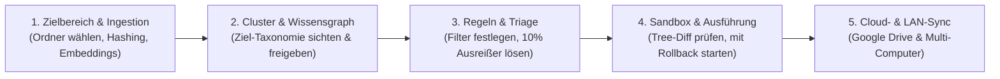

# Schritt-für-Schritt Benutzeranleitung — Hermes Auto-Organizer

Willkommen zur Benutzeranleitung für den **Hermes Auto-Organizer**. Dieses Dokument führt Sie praxisnah durch den vollständigen 5-Phasen-Workflow zur sicheren, semantischen und revisionssicheren Organisation Ihrer Dateien.

Das System folgt der **Dual-State-Architektur**: Es scannt den Ist-Zustand ($\mathcal{S}_{\text{now}}$), induziert eine ideale Zielstruktur ($\mathcal{S}_{\text{ideal}}$) und führt physische Dateioperationen **ausschließlich nach Ihrer expliziten Freigabe** und einem vorab berechneten **Dry-Run (Simulation)** aus. Keine Datei wird unwiderruflich gelöscht.

---

## Inhaltsübersicht

1. [Voraussetzungen & Aufruf](#1-voraussetzungen--aufruf)
2. [Überblick: Der 5-Phasen-Workflow](#2-überblick-der-5-phasen-workflow)
3. [Phase 1: Zielbereich & Ingestion (Wo wird gearbeitet?)](#3-phase-1-zielbereich--ingestion)
4. [Phase 2: Cluster & Wissensgraph (Wie soll die Ordnung aussehen?)](#4-phase-2-cluster--wissensgraph)
5. [Phase 3: Regeln & Ausreißer-Triage (Wie werden Dateien zugeordnet?)](#5-phase-3-regeln--ausreißer-triage)
6. [Phase 4: Sandbox & Reversible Ausführung (Überprüfen & Ausführen)](#6-phase-4-sandbox--reversible-ausführung)
7. [Phase 5: Cloud- & LAN-Sync (Multi-Host & Google Drive)](#7-phase-5-cloud---lan-sync)
8. [Sicherheit, Journal & 1-Klick Rollback](#8-sicherheit-journal--1-klick-rollback)
9. [Häufige Fragen (FAQ) & Troubleshooting](#9-häufige-fragen-faq--troubleshooting)

---

## 1. Voraussetzungen & Aufruf

1. **Dashboard öffnen**:
   Navigieren Sie im Browser zu:
   ```text
   http://localhost:9119/organizer
   ```
   *(Alternativ im Hermes Agent Web-Dashboard auf den Tab **Auto Organizer** in der Navigationsleiste klicken).*

2. **System-Status prüfen**:
   In der oberen Kopfzeile sehen Sie das Schnell-Diagnose-Tool:
   * **🐳 Docker Mounts**: Zeigt, ob alle Pfade zwischen Host (`/media/...`) und Container sauber gemountet sind.
   * **📁 Speicherwurzeln**: Listet Ihre registrierten Speicherorte auf.
   * **PostgreSQL / pgvector**: Status-Indikator für die Vektordatenbank.

---

## 2. Überblick: Der 5-Phasen-Workflow



> [!IMPORTANT]
> **Striktes Gating zur Datensicherheit**:
> Die Phasen 3, 4 und 5 sind gesperrt, bis Sie in Phase 1 die Indexierung gestartet und in Phase 2 das entstandene Kategoriensystem explizit per Klick freigegeben haben.

---

## 3. Phase 1: Zielbereich & Ingestion

In dieser Phase bestimmen Sie, welche Verzeichnisse analysiert werden sollen. **Es werden hierbei noch keinerlei Dateien verschoben.**

1. **Speicherorte auswählen**:
   * Sie sehen alle erkannten Ordner (z. B. lokale Platten, Download-Zonen, Cloud-Spiegel).
   * Nutzen Sie die Checkboxen oder klicken Sie auf **`🟢 Alle freigeben`**, um festzulegen, welche Pfade einbezogen werden.
   * Möchten Sie Ordner ignorieren, wählen Sie über den Schalter **`🔴 Ausschließen`**.
2. **Eigenen Pfad / Subtree analysieren**:
   * Im Panel *Subtree-Profiler & Entropie-Diagnose* können Sie jeden beliebigen absoluten Pfad eingeben und die Analysetiefe (`Tiefe 1–4`) wählen.
3. **Ingestion & Tiefenanalyse starten**:
   * Klicken Sie auf den Button **`🚀 Ingestion & Analyse starten`**.
   * Was im Hintergrund geschieht:
     * **Zweistufiges Hashing**: Schneller O(1) Header/Tail xxHash64 + gestreamtes SHA-256 zur Byte-Deduplizierung.
     * **Multi-Modale Extraktion**: Auslesen von Text (PDF, DOCX), Audio-Tags (`mutagen`), Video-Metadaten (`ffprobe`) und CAD-Layern (`ezdxf`).
     * **Vektorisierung**: Generierung von Einbettungen in PostgreSQL (`pgvector`).
4. **Weiter zu Phase 2**:
   * Nach Abschluss der Indexierung klicken Sie unten auf **`Weiter zu Schritt 2: Semantische Cluster & Wissensgraph →`**.

---

## 4. Phase 2: Cluster & Wissensgraph

Hier prüfen Sie die aus Ihren Dateien **natürlich entstandene Ziel-Taxonomie** ($S_{\text{ideal}}$).

1. **Kategoriensystem sichten**:
   * Auf der linken Seite sehen Sie die erkannten Hauptbereiche (z. B. Privatunterlagen, Buchhaltung, Projekte, Archiv) inklusive Dateianzahl, Konfidenz-Wert und Beispieldateien.
2. **Ansicht umschalten**:
   * **🌳 Natürliche Taxonomie & Ziel-Verzeichnisbaum**: Hierarchische Ordneransicht.
   * **🕸️ Animierter Obsidian-Graph**: Dynamischer Wissensgraph mit physikalischer Knotenverteilung.
3. **Redundanzen & Cloud-Spiegel prüfen**:
   * Falls identische Hash-Dateien lokal und in Google Drive liegen, schlägt das System vor, ob es sich um ein gewolltes Backup handelt.
4. **Freigabe erteilen (Gate-Unlock)**:
   * Klicken Sie auf den Button **`🌳 Gesamten Baum jetzt freigeben`** (oder bestätigen Sie die einzelnen Kategorien).
   * Erst durch diesen Klick werden die Phasen 3, 4 und 5 für die Regelerstellung und Ausführung freigeschaltet!
5. **Weiter zu Phase 3**:
   * Klicken Sie unten auf **`Weiter zu Schritt 3: Regeln & Ausreißer-Triage →`**.

---

## 5. Phase 3: Regeln & Ausreißer-Triage

In Phase 3 übersetzen Sie die freigegebene Zielstruktur in deterministische Regeln und entscheiden über die Sonderfälle.

### A. Modularer Regel-Baukasten (Der 90%-Standardfall)
1. **Regel benennen**: z. B. *"Rechnungen automatisch archivieren"*.
2. **Verknüpfung wählen**:
   * **UND (Alle Bedingungen)**: Alle Kriterien müssen erfüllt sein.
   * **ODER (Mindestens eine)**: Ein Kriterium genügt.
3. **Kriterien kombinieren**:
   * `📂 Quellordner`: z. B. `beginnt mit /home/mb/Downloads`
   * `⏱️ Zeitraum`: z. B. `älter als 14 Tage`
   * `🔍 Schlagwort`: z. B. `enthält "Rechnung"` (in Dateiname und/oder Volltext)
   * `📄 Dateityp`: z. B. `ist eine von pdf, docx`
4. **Zielpfad-Vorlage festlegen**: z. B. `/media/privat-data/10_PrivatBüro/{year}/Steuern/` *(Platzhalter wie `{year}` werden dynamisch ersetzt)*.
5. **Regel testen & speichern**:
   * Klicken Sie auf **`🔍 Regel an vorhandenen Dateien testen`** — Sie sehen sofort, welche Dateien davon erfasst würden.
   * Klicken Sie auf **`💾 Regel speichern & aktivieren`**.

### B. Ausreißer-Triage (Die 10% Sonderfälle)
Dateien mit widersprüchlichen Schlagwörtern oder unklaren Ablageorten landen in der **Ausreißer-Triage-Queue**:
* Für jeden Einzelfall liefert das System einen konkreten Lösungsvorschlag mit Begründung.
* Sie entscheiden per 1-Klick:
  * **`✅ Vorschlag annehmen`**: Verschiebung wird vorgemerkt.
  * **`❌ Ignorieren`**: Datei verbleibt an ihrem aktuellen Ort.

Klicken Sie anschließend auf **`Weiter zu Schritt 4: Sandbox & Reversible Ausführung →`**.

---

## 6. Phase 4: Sandbox & Reversible Ausführung

Bevor physisch auch nur ein Inode auf der Festplatte bewegt wird, prüft die Sandbox alle Aktionen auf Schreibrechte, Mount-Präsenz und Kollisionen.

1. **Simulation starten**:
   * Klicken Sie auf **`🔄 Simulation neu starten`**.
   * Die Liste der geplanten Dateioperationen wird erstellt.
2. **Prüfansichten nutzen**:
   * **⚖️ "Von → Nach" Tree-Diff**: Zeigt rot markierte Quellpfade und grün markierte Zielpfade im hierarchischen Baum.
   * **📑 Abstrakte Ausführungsgruppen**: Gruppiert nach Themen/Zielordnern mit Checkboxen zur selektiven Freigabe.
   * **📋 Technische Diff-Tabelle**: Detaillierte Tabelle mit Dateigrößen, Quell-/Zielpfaden und Sicherheits-Ampeln (`✓ RW`, `Bereit zur Ausführung`).
3. **Sichere Ausführung starten**:
   * Wählen Sie die gewünschten Gruppen aus.
   * Klicken Sie auf den grünen Button:
     ```text
     ⚡ Freigegebene Gruppen ausführen (X Dateien)
     ```
   * Das System verschiebt die Dateien atomar, verifiziert die SHA-256-Prüfsumme nach dem Move und schreibt jede Transaktion in das Journal.

---

## 7. Phase 5: Cloud- & LAN-Sync

In der finalen Phase konfigurieren Sie die Zusammenarbeit über Cloud- und Netzwerkgrenzen hinweg.

1. **Google Drive Ordner-Mappings**:
   * Klicken Sie auf **`+ Neuer Sync-Ordner`**.
   * Verknüpfen Sie einen Remote-Google-Drive-Ordner mit einem lokalen Verzeichnis.
   * Wählen Sie die Richtung: `bidirectional` (Zwei-Wege-Abgleich), `upload_only` oder `download_only`.
   * Tragen Sie Dateifilter ein (z. B. `*.pdf, *.docx`).
2. **Multi-Host LAN-Radar**:
   * Über die Schaltfläche **`🌐 Multi-Computer Tree & Radar Fenster`** können Sie den Status verbundener LAN-Geräte (z. B. Laptop, Debian-Server) und Syncthing-Shares einsehen.

---

## 8. Sicherheit, Journal & 1-Klick Rollback

Sollte eine Reorganisation rückgängig gemacht werden müssen:

1. Klicken Sie in der Navigationsleiste auf **`📜 Reorganisations-Journal & Rollback`**.
2. Sie sehen alle ausgeführten Batches mit Zeitstempel, Anzahl der Dateien und Status.
3. Klicken Sie neben dem gewünschten Batch auf **`↩️ Rollback ausführen`**:
   * Das System prüft die SHA-256-Hashes der Zieldateien.
   * Alle unveränderten Dateien werden exakt an ihren ursprünglichen Quellort in umgekehrter Reihenfolge (LIFO) zurückverschoben.
   * Es findet niemals ein dauerhaftes Löschen statt (`send2trash`-Sicherheitsprinzip).

---

## 9. Häufige Fragen (FAQ) & Troubleshooting

### F: Werden Dateien beim Scannen in Phase 1 bereits verändert?
**A:** Nein. Phase 1 liest lediglich Metadaten und berechnet Hashes. Es finden keine Schreib- oder Verschiebevorgänge auf Ihren Daten statt.

### F: Was passiert bei gleichnamigen Zieldateien (Kollisionen)?
**A:** Das System überschreibt niemals vorhandene Dateien. Die `CollisionPolicy` benennt die Datei nach dem Schema `{Name}_conflict_{Timestamp}_{Hash}.{ext}` um.

### F: Warum ist Schritt 3 oder 4 bei mir gesperrt?
**A:** Bitte stellen Sie sicher, dass Sie in Phase 2 auf **`🌳 Gesamten Baum jetzt freigeben`** geklickt haben. Erst die Freigabe des Kategoriensystems entsperrt die Regelerstellung und Simulation.

### F: Was tun, wenn ein Docker Mount als "Ungültig" markiert ist?
**A:** Öffnen Sie oben **`🐳 Docker Mounts`** und prüfen Sie, ob der Pfad in Ihrer `docker-compose.yml` bzw. im Container-Setup gemountet ist. Das System blockiert automatisch Moves in ungemountete Pfade, um Datenverlust zu verhindern.
